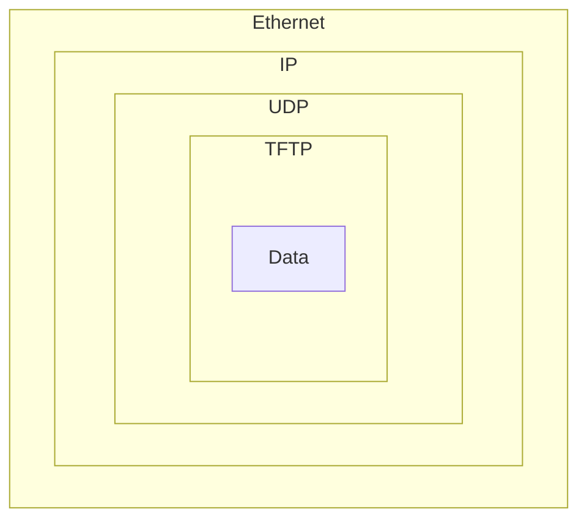

# 소켓이란?

- 유닉스 파일 기술자(Unix file descriptor)를 사용해 다른 프로그램과 소통하는 방법
- 파일 기술자 생성?
  - `socket()` 시스템 루틴을 호출하면 소켓 기술자를 반환하는데, `send()`, `recv()`와 같은 소켓에 관한 함수를 호출하여 정보를 교환할 수 있다.
- 일반적인 `read()`, `write()` 호출로도 소켓을 통해 통신할 수 있지만 `send()`와 `recv()`를 이용하는 것이 데이터 전송을 제어하기에 더 좋다.
- 소켓 종류
  - DARPA 인터넷 소켓
  - 로컬 노드의 경로명(유닉스 소켓)
  - CCITT X.25 소켓(무시해도 괜찮음)
  - 그 외

## 인터넷 소켓의 두 종류

- 더 있지만 두 종류만 소개
- Stream Socket(`SOCK_STREAM`), Datagram Socket(`SOCK_DGRAM`)

### Stream Socket

- 신뢰할 수 있는 양방향으로 연결된 통신 스트림
- 아이템 두 개를 소켓을 통해 보낸다면 반대쪽에서는 보낸 순서대로 도착하며, 오류도 발생하지 않는다.
- 오류가 발생한다면 그건 당신 잘못.
- `telnet`, `ssh`, HTTP가 사용
  - 80번 포트에 텔넷으로 접속해 "GET / HTTP/1.0"을 입력하고 RETURN을 두 번 치면 HTML이 반환될 것이다.
- TCP(Transmission Control Protocol)을 사용한다.
  - TCP는 데이터가 순서대로, 그리고 오류 없이 도착하도록 한다.
  - TCP/IP를 통해 많이 들어봤을 것이다.
  - IP는 Internet Protocol의 준말인데, 우선적으로 인터넷 라우팅을 다루며 보통 데이터 무결성에 책임이 있지는 않다.

### Datagram Socket

- `connect()`를 사용할 수 있긴 하지만 때로 비연결 소켓이라고도 불린다.
- 데이터그램을 전송하면 도착할 수도 있다.
- 도착은 하는데 순서가 다를 수 있다.
- 도착한다면 패킷 내부의 정보에는 오류가 없을 것이다.
- 데이터그램 소켓 또한 라우팅에 IP를 사용하지만 TCP 대신 UDP(User Datagram Protocol)을 사용한다.
- 비연결: 스트림 소켓처럼 열려있는 연결을 지속할 필요가 없다.
- 패킷을 생성하고, 목적지 정보가 담긴 IP 헤더를 붙여 보내기만 하면 된다.
- TCP 스택을 사용할 수 없는 경우 또는 이곳 저곳에 떨어진 패킷이 중요하지 않을 때 사용된다.
- `tftp`(trivial file transfer protocol, FTP의 동생), `dhcpcd`(DHCP 클라이언트) 등
  - UDP 위에 프로토콜이 있다. 가령 보내고 5초 후에 받았다는 신호가 오지 않으면 수신되었다는 신호가 올 때까지 패킷을 다시 보낸다.
  - 게임, 오디오, 비디오 같은 경우 누락된 패킷을 무시하거나 적절히 누락된 부분을 메꾸려고 한다.
- 신뢰성이 떨어지는 프로토콜을 사용하는 이유?
  - 속도 때문에
  - 보낸게 제대로 도착은 했는지, 순서는 맞는지를 계속 추적하는 것보다 보내고 난 후에는 잊는 것이 더 빠르다.

### 저레벨의 이해할 수 없는 무언가와 네트워크 이론

#### 데이터 캡슐화

1. 패킷
2. 첫 번째 프로토콜에 의해 헤더(그리고 드물게는 푸터)로 패킷 감싸기: 캡슐화
3. 두 번째 프로토콜에 의해 2번의 결과가 통째로 캡슐화
4. 세 번째 프로토콜에 의해 3번의 결과가 통째로 캡슐화
5. 하드웨어(물리) 레이어에 있는 마지막 프로토콜에 의해 4번의 결과가 통째로 캡슐화

- 다른 컴퓨터가 패킷을 받으면 하드웨어는 이더넷 헤더를 뗀다.
- 그 다음 커널이 IP와 UDP 헤더를 떼고,
- TFTP 프로그램이 TFTP 헤더를 뗀 다음
- 데이터가 남는다.

##### OSI 7계층

- 응용 계층
- 표현 계층
- 세션 계층
- 전송 계층
- 네트워크 계층
- 데이터 링크 계층
- 물리 계층

- 유닉스의 경우 더 실질적인 레이어 모델은 아마 다음과 같을 것이다.
  - Application Layer(telnet, ftp, etc.)
  - Host-to-Host Transport Layer(TCP, UDP)
  - Internet Layer(IP and routing)
  - Network Access Layer(Ethernet, wi-if, or whatever)

- 스트림 소켓의 경우 데이터를 `send()`로 보내면 된다.
- 데이터그램 소켓의 경우 선택한 방법으로 패킷을 캡슐화시킨 후에 `sendto()`로 보내면 된다.
- 커널이 전송 레이어와 인터넷 레이어를 빌드하며, 하드웨어가 네트워크 액세스 레이어를 빌드한다.
- 라우터: 패킷에서 IP 헤더를 떼고 라우팅 테이블을 참조해......로 이어진다.
