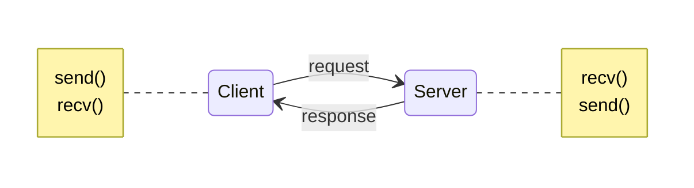

# 클라이언트-서버 배경

클라이언트 프로세스를 다루는 네트워크 상의 모든 것은 서버 프로세스와 통신한다. `telnet`을 예로 들면, 원격 포트 23번에 telnet으로 연결할 때(클라이언트) 그 호스트에 있는 프로그램(`telnetd`로 불림, 서버)이 동작한다. 그 프로그램은 들어오는 telnet 연결을 다루고 로그인 프롬프트를 설정하는 등의 동작을 한다.



클라이언트와 서버 간의 정보 교환은 위의 다이어그램에서 간략하게 확인할 수 있다.

클라이언트-서버 쌍은 서로 같은 것을 speak하고 있는 한 `SOCK_STREAM`, `SOCK_DGRAM`, 또는 다른 것을 speak할수 있다. `telnet`/`telnetd`, `ftp`/`ftpd`, `Firefox/Apache`와 같은 예시가 있다.

기기에 서버가 단 하나 있고, 그 서버가 `fork()`를 사용해 복수의 클라이언트를 다룰 수도 있다. 기본 순서는 다음과 같다: 서버가 연결을 기다리고, `accept()`하고, 그것을 다루기 위한 자식 프로세스를 `fork()`한다.

## 간단한 스트림 서버

이 서버는 스트림 연결에 문자열 `Hello, world!`를 보낸다. 이 서버를 시험하려면 하나의 창에서 서버를 실행하고, 다른 창에서 다음 명령어로 telnet을 사용한다.

```bash
$ telnet remotehostname 3490
```

`remotehostname`은 실행 중인 기기의 이름이다.

```c
/*
** server.c -- a stream socket server demo
*/

#include <stdio.h>
#include <stdlib.h>
#include <unistd.h>
#include <errno.h>
#include <string.h>
#include <sys/types.h>
#include <sys/socket.h>
#include <netinet/in.h>
#include <netdb.h>
#include <arpa/inet.h>
#include <sys/wait.h>
#include <signal.h>

#define PORT "3490"  // the port users will be connecting to

#define BACKLOG 10   // how many pending connections queue will hold

void sigchld_handler(int s)
{
    // waitpid() might overwrite errno, so we save and restore it:
    int saved_errno = errno;

    while(waitpid(-1, NULL, WNOHANG) > 0);

    errno = saved_errno;
}


// get sockaddr, IPv4 or IPv6:
void *get_in_addr(struct sockaddr *sa)
{
    if (sa->sa_family == AF_INET) {
        return &(((struct sockaddr_in*)sa)->sin_addr);
    }

    return &(((struct sockaddr_in6*)sa)->sin6_addr);
}

int main(void)
{
    int sockfd, new_fd;  // listen on sock_fd, new connection on new_fd
    struct addrinfo hints, *servinfo, *p;
    struct sockaddr_storage their_addr; // connector's address information
    socklen_t sin_size;
    struct sigaction sa;
    int yes=1;
    char s[INET6_ADDRSTRLEN];
    int rv;

    memset(&hints, 0, sizeof hints);
    hints.ai_family = AF_UNSPEC;
    hints.ai_socktype = SOCK_STREAM;
    hints.ai_flags = AI_PASSIVE; // use my IP

    if ((rv = getaddrinfo(NULL, PORT, &hints, &servinfo)) != 0) {
        fprintf(stderr, "getaddrinfo: %s\n", gai_strerror(rv));
        return 1;
    }

    // loop through all the results and bind to the first we can
    for(p = servinfo; p != NULL; p = p->ai_next) {
        if ((sockfd = socket(p->ai_family, p->ai_socktype,
                p->ai_protocol)) == -1) {
            perror("server: socket");
            continue;
        }

        if (setsockopt(sockfd, SOL_SOCKET, SO_REUSEADDR, &yes,
                sizeof(int)) == -1) {
            perror("setsockopt");
            exit(1);
        }

        if (bind(sockfd, p->ai_addr, p->ai_addrlen) == -1) {
            close(sockfd);
            perror("server: bind");
            continue;
        }

        break;
    }

    freeaddrinfo(servinfo); // all done with this structure

    if (p == NULL)  {
        fprintf(stderr, "server: failed to bind\n");
        exit(1);
    }

    if (listen(sockfd, BACKLOG) == -1) {
        perror("listen");
        exit(1);
    }

    sa.sa_handler = sigchld_handler; // reap all dead processes
    sigemptyset(&sa.sa_mask);
    sa.sa_flags = SA_RESTART;
    if (sigaction(SIGCHLD, &sa, NULL) == -1) {
        perror("sigaction");
        exit(1);
    }

    printf("server: waiting for connections...\n");

    while(1) {  // main accept() loop
        sin_size = sizeof their_addr;
        new_fd = accept(sockfd, (struct sockaddr *)&their_addr, &sin_size);
        if (new_fd == -1) {
            perror("accept");
            continue;
        }

        inet_ntop(their_addr.ss_family,
            get_in_addr((struct sockaddr *)&their_addr),
            s, sizeof s);
        printf("server: got connection from %s\n", s);

        if (!fork()) { // this is the child process
            close(sockfd); // child doesn't need the listener
            if (send(new_fd, "Hello, world!", 13, 0) == -1)
                perror("send");
            close(new_fd);
            exit(0);
        }
        close(new_fd);  // parent doesn't need this
    }

    return 0;
}
```

다음 절에서 언급되는 클라이언트를 사용해 이 서버에서 데이터를 불러올 수 있다.

## 간단한 스트림 클라이언트

이 클라이언트는 명령줄에서 명시한 호스트의 3490번 포트에 연결한다. 서버가 보낸 문자열을 받는다.

```c
/*
** client.c -- a stream socket client demo
*/

#include <stdio.h>
#include <stdlib.h>
#include <unistd.h>
#include <errno.h>
#include <string.h>
#include <netdb.h>
#include <sys/types.h>
#include <netinet/in.h>
#include <sys/socket.h>

#include <arpa/inet.h>

#define PORT "3490" // the port client will be connecting to 

#define MAXDATASIZE 100 // max number of bytes we can get at once 

// get sockaddr, IPv4 or IPv6:
void *get_in_addr(struct sockaddr *sa)
{
    if (sa->sa_family == AF_INET) {
        return &(((struct sockaddr_in*)sa)->sin_addr);
    }

    return &(((struct sockaddr_in6*)sa)->sin6_addr);
}

int main(int argc, char *argv[])
{
    int sockfd, numbytes;  
    char buf[MAXDATASIZE];
    struct addrinfo hints, *servinfo, *p;
    int rv;
    char s[INET6_ADDRSTRLEN];

    if (argc != 2) {
        fprintf(stderr,"usage: client hostname\n");
        exit(1);
    }

    memset(&hints, 0, sizeof hints);
    hints.ai_family = AF_UNSPEC;
    hints.ai_socktype = SOCK_STREAM;

    if ((rv = getaddrinfo(argv[1], PORT, &hints, &servinfo)) != 0) {
        fprintf(stderr, "getaddrinfo: %s\n", gai_strerror(rv));
        return 1;
    }

    // loop through all the results and connect to the first we can
    for(p = servinfo; p != NULL; p = p->ai_next) {
        if ((sockfd = socket(p->ai_family, p->ai_socktype,
                p->ai_protocol)) == -1) {
            perror("client: socket");
            continue;
        }

        if (connect(sockfd, p->ai_addr, p->ai_addrlen) == -1) {
            close(sockfd);
            perror("client: connect");
            continue;
        }

        break;
    }

    if (p == NULL) {
        fprintf(stderr, "client: failed to connect\n");
        return 2;
    }

    inet_ntop(p->ai_family, get_in_addr((struct sockaddr *)p->ai_addr),
            s, sizeof s);
    printf("client: connecting to %s\n", s);

    freeaddrinfo(servinfo); // all done with this structure

    if ((numbytes = recv(sockfd, buf, MAXDATASIZE-1, 0)) == -1) {
        perror("recv");
        exit(1);
    }

    buf[numbytes] = '\0';

    printf("client: received '%s'\n",buf);

    close(sockfd);

    return 0;
}
```

- 클라이언트를 실행하기 전에 서버를 실행하지 않으면 `connect()`가 "Connection refused"를 반환한다.

## 데이터그램 소켓

`sendto()`와 `recvfrom()`을 논의할 때 UDP 데이터그램 소켓의 기본을 다루었다. 그러므로 `talker.c`와 `listener.c`라는 두 개의 샘플 프로그램을 제공한다.

`listener`는 4950번 포트에 들어오는 패킷을 기다린다. `talker`는 사용자가 명령줄에 뭔가 입력한 것을 포함하는 패킷을 명시된 기계의 그 포트로 보낸다.

데이터그램 소켓이 비연결성이고 성공여부와는 관계 없이 그저 패킷을 보내기 때문에, 클라이언트와 서버가 명시적으로 IPv6을 사용한다고 하자. 이렇게 되면 서버가 IPv6을 listen하고 클라이언트가 IPv4를 송신해 데이터를 받을 수 없는 상황을 피할 수 있다.

```c
/*
** listener.c -- a datagram sockets "server" demo
*/

#include <stdio.h>
#include <stdlib.h>
#include <unistd.h>
#include <errno.h>
#include <string.h>
#include <sys/types.h>
#include <sys/socket.h>
#include <netinet/in.h>
#include <arpa/inet.h>
#include <netdb.h>

#define MYPORT "4950"    // the port users will be connecting to

#define MAXBUFLEN 100

// get sockaddr, IPv4 or IPv6:
void *get_in_addr(struct sockaddr *sa)
{
    if (sa->sa_family == AF_INET) {
        return &(((struct sockaddr_in*)sa)->sin_addr);
    }

    return &(((struct sockaddr_in6*)sa)->sin6_addr);
}

int main(void)
{
    int sockfd;
    struct addrinfo hints, *servinfo, *p;
    int rv;
    int numbytes;
    struct sockaddr_storage their_addr;
    char buf[MAXBUFLEN];
    socklen_t addr_len;
    char s[INET6_ADDRSTRLEN];

    memset(&hints, 0, sizeof hints);
    hints.ai_family = AF_INET6; // set to AF_INET to use IPv6
    hints.ai_socktype = SOCK_DGRAM;
    hints.ai_flags = AI_PASSIVE; // use my IP

    if ((rv = getaddrinfo(NULL, MYPORT, &hints, &servinfo)) != 0) {
        fprintf(stderr, "getaddrinfo: %s\n", gai_strerror(rv));
        return 1;
    }

    // loop through all the results and bind to the first we can
    for(p = servinfo; p != NULL; p = p->ai_next) {
        if ((sockfd = socket(p->ai_family, p->ai_socktype,
                p->ai_protocol)) == -1) {
            perror("listener: socket");
            continue;
        }

        if (bind(sockfd, p->ai_addr, p->ai_addrlen) == -1) {
            close(sockfd);
            perror("listener: bind");
            continue;
        }

        break;
    }

    if (p == NULL) {
        fprintf(stderr, "listener: failed to bind socket\n");
        return 2;
    }

    freeaddrinfo(servinfo);

    printf("listener: waiting to recvfrom...\n");

    addr_len = sizeof their_addr;
    if ((numbytes = recvfrom(sockfd, buf, MAXBUFLEN-1 , 0,
        (struct sockaddr *)&their_addr, &addr_len)) == -1) {
        perror("recvfrom");
        exit(1);
    }

    printf("listener: got packet from %s\n",
        inet_ntop(their_addr.ss_family,
            get_in_addr((struct sockaddr *)&their_addr),
            s, sizeof s));
    printf("listener: packet is %d bytes long\n", numbytes);
    buf[numbytes] = '\0';
    printf("listener: packet contains \"%s\"\n", buf);

    close(sockfd);

    return 0;
}
```

- `getaddrinfo()`에서 `SOCK_DGRAM`을 사용한다.
- `listen()`이나 `accept()`를 할 필요가 없다: 비연결 데이터그램 소켓 사용의 장점

```c
/*
** talker.c -- a datagram "client" demo
*/

#include <stdio.h>
#include <stdlib.h>
#include <unistd.h>
#include <errno.h>
#include <string.h>
#include <sys/types.h>
#include <sys/socket.h>
#include <netinet/in.h>
#include <arpa/inet.h>
#include <netdb.h>

#define SERVERPORT "4950"    // the port users will be connecting to

int main(int argc, char *argv[])
{
    int sockfd;
    struct addrinfo hints, *servinfo, *p;
    int rv;
    int numbytes;

    if (argc != 3) {
        fprintf(stderr,"usage: talker hostname message\n");
        exit(1);
    }

    memset(&hints, 0, sizeof hints);
    hints.ai_family = AF_INET6; // set to AF_INET to use IPv6
    hints.ai_socktype = SOCK_DGRAM;

    if ((rv = getaddrinfo(argv[1], SERVERPORT, &hints, &servinfo)) != 0) {
        fprintf(stderr, "getaddrinfo: %s\n", gai_strerror(rv));
        return 1;
    }

    // loop through all the results and make a socket
    for(p = servinfo; p != NULL; p = p->ai_next) {
        if ((sockfd = socket(p->ai_family, p->ai_socktype,
                p->ai_protocol)) == -1) {
            perror("talker: socket");
            continue;
        }

        break;
    }

    if (p == NULL) {
        fprintf(stderr, "talker: failed to create socket\n");
        return 2;
    }

    if ((numbytes = sendto(sockfd, argv[2], strlen(argv[2]), 0,
             p->ai_addr, p->ai_addrlen)) == -1) {
        perror("talker: sendto");
        exit(1);
    }

    freeaddrinfo(servinfo);

    printf("talker: sent %d bytes to %s\n", numbytes, argv[1]);
    close(sockfd);

    return 0;
}
```

기기에서 `listener`를 실행하고 다른 기기에서 `talker`를 실행하면 통신하는 것을 볼 수 있다.

서버를 실행하지 않고 그냥 `talker`를 실행해 반대쪽에서 `recvfrom()`을 사용해 listen할 준비가 되지 않아 그저 패킷이 사라지게 할 수도 있다.(**UDP 데이터그램 소켓을 사용해 송신한 데이터는 도착을 보장하지 않는다!**)

### 연결된 데이터그램 소켓

1. `talker`가 `connect()`를 호출하고 `listener`의 주소를 명시한다고 하자.
2. 그 지점부터 `talker`는 `connect()`에 의해 명시된 주소로만 송신하거나 수신할 것이다.
3. 이러한 이유로 `sendto()`와 `recvfrom()`을 사용할 필요 없이 `send()`와 `recv()`를 사용할 수 있다.
